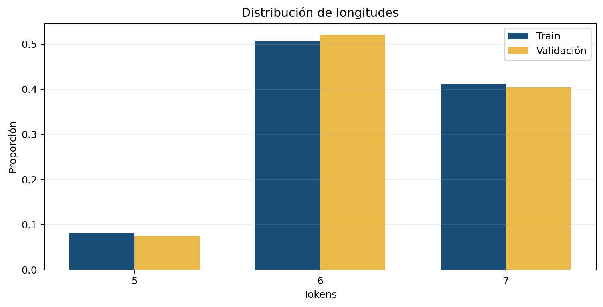
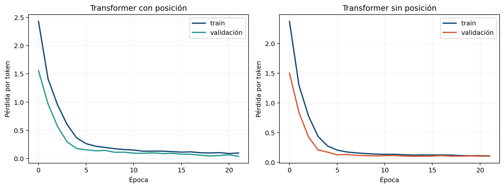

<div align="center">

# 🧠 Reto Babel: atención y Transformers

**Laboratorio 5 · Deep Learning y Sistemas Inteligentes · Universidad del Valle de Guatemala**


**Pablo Daniel Barillas Moreno · 22193**  
**Cindy Mishelle Gualim Pérez · 221226**  
**Gadiel Ocaña · 231270**

</div>

---

## Resumen ejecutivo

Este repositorio documenta la construcción desde cero de un traductor neuronal para el “Reto Babel”. A partir de un diccionario secreto–español y pares paralelos, se implementó un encoder–decoder con `torch.nn.Transformer`, atención multi-cabeza, máscaras causales y de padding, teacher forcing y decodificación autoregresiva. El experimento central compara dos modelos idénticos excepto por la codificación posicional.

El modelo con posición obtuvo **98.16% de exactitud por token** y **94.17% de frases completamente correctas** sobre 240 ejemplos de validación. Sin posición, los valores bajaron a **77.88%** y **54.17%**. Esta caída de 20.28 y 40.00 puntos porcentuales respalda la hipótesis de que la posición es esencial cuando traducir exige reorganizar sujeto, verbo, objeto, adjetivo y negación.

El EDA complementario muestra que no existen frases repetidas entre entrenamiento y validación ni tokens fuera de vocabulario. Por eso, el resultado no puede explicarse mediante copia literal ni desconocimiento léxico. Los 14 errores residuales se concentran en estructuras simétricas: sujeto y objeto comparten determinante y el modelo puede intercambiar sus roles.

## Acceso rápido

| Recurso | Descripción |
|---|---|
| [Notebook oficial](notebooks/S09_Lab05_Reto_Babel_ESTUDIANTE.ipynb) | Entrega solicitada por la rúbrica: investigación, datos, modelo, entrenamiento, evaluación y ablación. |
| [Notebook EDA](notebooks/EDA_Reto_Babel_Lab05.ipynb) | Evidencia de integridad, cobertura, longitudes, estructuras y diagnóstico de errores. |
| [Evidencia del Integrante A](notebooks/evidencia_individual/S09_Lab05_Integrante_A.ipynb) | Lectura sobre atención y preparación de lotes, padding y máscaras asignadas a Pablo. |
| [Informe PDF](informe/informe_Lab05_Reto_Babel.pdf) | Informe compilado de siete páginas con investigación, método, EDA, resultados y conclusiones. |
| [Presentación HTML](presentacion/presentacion_Lab05_Reto_Babel.html) | Presentación autónoma de ocho diapositivas; funciona sin conexión. |
| [Resultados JSON](resultados/resultados_lab5.json) | Métricas, curvas, subgrupos y errores exportados por el notebook oficial. |
| [Instrucciones](documentacion/S09_Lab05_Reto_Babel_Instrucciones.pdf) | PDF original del laboratorio. |

## Organización

```text
Laboratorio-5_Deep-Learning/
├── README.md
├── datos/
│   └── CARPETA_DATOS/              # diccionario, train, validación y ZIP original
├── documentacion/                   # instrucciones oficiales
├── evidencia/
│   └── figuras/                     # gráficas del modelo y del EDA
├── informe/                         # fuente .tex y PDF compilado
├── notebooks/                       # notebook oficial, EDA y evidencia individual ejecutados
├── presentacion/                    # presentación HTML autónoma
└── resultados/                      # salida estructurada del experimento
```

La raíz conserva únicamente `README.md` como punto de entrada convencional del repositorio; los demás archivos se encuentran clasificados por función.

## Datos y análisis exploratorio

El corpus contiene 1,200 pares de entrenamiento, 240 de validación y un diccionario de 22 equivalencias. Tras añadir `<PAD>`, `<SOS>`, `<EOS>` y `<UNK>`, los vocabularios fuente y objetivo poseen 26 símbolos cada uno.

| Indicador | Entrenamiento | Validación | Lectura |
|---|---:|---:|---|
| Frases únicas | 1,200 | 240 | No hay duplicados internos. |
| Traslape train–validación | 0 | 0 | Se evalúan combinaciones no vistas literalmente. |
| Tokens fuera de vocabulario | — | 0 | La dificultad no proviene de OOV. |
| Longitudes | 5–7 | 5–7 | Distribución corta y comparable. |
| Frases con negación | 49.25% | 47.92% | El rasgo está equilibrado entre particiones. |
| Sujeto y objeto con igual determinante | 43.42% | 48.33% | Es el subgrupo estructural más ambiguo. |



## Arquitectura y entrenamiento

El traductor utiliza dimensión de embedding 48, cuatro cabezas, dos capas de encoder y dos de decoder, dimensión feed-forward 96 y dropout 0.1. En total posee **98,810 parámetros entrenables**, dentro del límite solicitado. Se entrenó 22 épocas con Adam (`lr=2e-3`), lotes de 64, clipping de norma 1 y semilla 42.

Durante teacher forcing, el decoder recibe el objetivo desplazado: `tgt[:, :-1]` como entrada y `tgt[:, 1:]` como etiqueta. La entropía cruzada ignora `<PAD>` y la pérdida se agrega por tokens reales. En inferencia, la traducción comienza con `<SOS>`, genera un token por paso y termina al producir `<EOS>` o alcanzar el límite.

La ablación mantiene constantes datos, semilla, arquitectura, optimizador, lotes y épocas. El único cambio es `usar_posicion=False`; por ello, la diferencia observada puede atribuirse a la información posicional dentro del protocolo controlado.

## Resultados

| Configuración | Mejor pérdida de validación | Exactitud por token | Frases exactas |
|---|---:|---:|---:|
| Transformer con posición | 0.0406 | 98.16% | 94.17% |
| Transformer sin posición | 0.1044 | 77.88% | 54.17% |
| Diferencia a favor de posición | — | +20.28 pp | +40.00 pp |



La exactitud por token mide coincidencias locales, mientras que la exactitud de frase exige que **todos** los tokens sean correctos. Por eso 98.16% por token equivale a 94.17% de frases exactas: unos pocos intercambios de roles invalidan la oración completa. El subgrupo con negación alcanza 97.71% por token y 92.17% por frase, frente a 98.63% y 96.00% sin negación; la brecha existe, pero es menor que la causada por retirar posición.

## Diagnóstico y siguiente iteración

El modelo ya produce resultados altos y coherentes, pero todavía falla en 14 de 240 oraciones. La muestra de errores revela inversiones sujeto–objeto cuando ambas entidades tienen el mismo artículo. El siguiente ciclo debe ser deliberado:

1. Reportar métricas para igual/diferente determinante y por longitud.
2. Visualizar atención y gradientes de ejemplos simétricos correctamente e incorrectamente resueltos.
3. Probar semillas adicionales para estimar variabilidad.
4. Solo entonces comparar una intervención a la vez: scheduler, más épocas con parada temprana, aumento moderado de `d_model` o ejemplos dirigidos.
5. Conservar como benchmark el modelo actual y repetir la ablación posicional bajo la configuración ganadora.

No se cambian hiperparámetros en esta versión porque el propósito del EDA es justificar la siguiente decisión, no optimizar sobre la validación sin un protocolo previo.

## Reproducción

Desde la raíz del proyecto, con Python, PyTorch, Matplotlib, Jupyter y nbformat disponibles:

```powershell
python -m jupyter nbconvert --to notebook --execute --inplace --ExecutePreprocessor.timeout=1200 "notebooks\S09_Lab05_Reto_Babel_ESTUDIANTE.ipynb"
python -m jupyter nbconvert --to notebook --execute --inplace --ExecutePreprocessor.timeout=300 "notebooks\EDA_Reto_Babel_Lab05.ipynb"
```

Para recompilar el informe:

```powershell
Set-Location informe
pdflatex -interaction=nonstopmode -halt-on-error informe_Lab05_Reto_Babel.tex
pdflatex -interaction=nonstopmode -halt-on-error informe_Lab05_Reto_Babel.tex
```

## Correspondencia con la rúbrica

| Bloque | Evidencia principal |
|---|---|
| 0 · Investigación guiada | Secciones iniciales del notebook oficial e informe: artículo, encoder/decoder, atención, posición y costos. |
| 1 · Carga y vocabularios | Lectura estándar de CSV, tokens especiales, exploración y verificaciones. |
| 2 · Lotes, padding y máscaras | `Dataset`, `DataLoader`, padding, máscara causal y de padding. |
| 3 · Traductor con `nn.Transformer` | Embeddings, posición, encoder–decoder y límite de parámetros. |
| 4 · Teacher forcing | Desplazamiento del objetivo, pérdida y entrenamiento reproducible. |
| 5 · Traducción y evaluación | Decodificación autoregresiva, exactitud por token y frase. |
| 6 · Ablación posicional | Comparación controlada y veredicto cuantitativo. |
| 7 · Traducciones finales y grupo | Celda preparada para frases oficiales y registro de contribuciones. |

La entrega formal indicada por el PDF es el **notebook oficial ejecutado**. El EDA, el informe, la presentación y los resultados constituyen evidencia complementaria. Las frases finales del reto deben pegarse en la celda reservada cuando sean proporcionadas por el curso; no se inventan ni se traducen con servicios externos.

## Referencias

- Vaswani, A., et al. (2017). *Attention Is All You Need*. Advances in Neural Information Processing Systems, 30. https://arxiv.org/abs/1706.03762
- PyTorch. (2026). *Transformer documentation*. https://docs.pytorch.org/docs/stable/generated/torch.nn.Transformer.html
- PyTorch. (2026). *Transformer tutorial*. https://docs.pytorch.org/tutorials/beginner/transformer_tutorial.html
- Alammar, J. (2018). *The Illustrated Transformer*. https://jalammar.github.io/illustrated-transformer/

## Integrantes y contribuciones

- **Pablo Daniel Barillas Moreno (22193), Integrante A:** lectura sobre atención, investigación guiada, lotes, padding, máscara causal y máscaras de padding.
- **Cindy Mishelle Gualim Pérez (221226), Integrante B:** configuración del Transformer, teacher forcing, entrenamiento, seguimiento de pérdidas y reproducibilidad.
- **Gadiel Ocaña (231270), Integrante C:** decodificación progresiva, evaluación, experimento de posición, análisis de errores y revisión de resultados.

Los tres integrantes revisaron el flujo completo y deben poder explicar todos los bloques del laboratorio.
