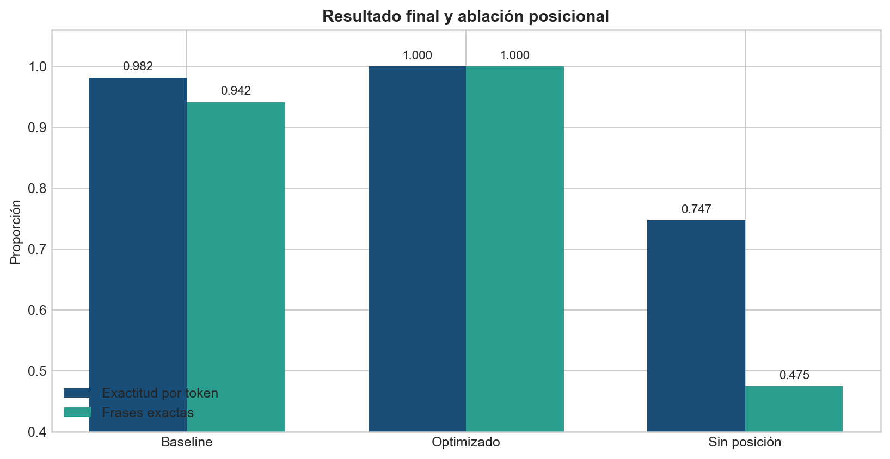

<div align="center">

# 🧠 Reto Babel · Transformer optimizado post-EDA

**Deep Learning y Sistemas Inteligentes · Laboratorio 5 · Grupo 1 · Sección 30**


**Pablo Daniel Barillas Moreno · 22193 · Integrante A**  
**Cindy Mishelle Gualim Pérez · 221226 · Integrante B**  
**Gadiel Ocaña · 231270 · Integrante C**

</div>

---

## Navegación

- [🧠 Reto Babel · Transformer optimizado post-EDA](#-reto-babel--transformer-optimizado-post-eda)
  - [Navegación](#navegación)
  - [Resultado](#resultado)
  - [Archivos principales](#archivos-principales)
  - [Cobertura de la rúbrica](#cobertura-de-la-rúbrica)
  - [Estructura](#estructura)
  - [De la exploración a la decisión](#de-la-exploración-a-la-decisión)
  - [Arquitectura y aprendizaje](#arquitectura-y-aprendizaje)
  - [Protocolo sin fuga](#protocolo-sin-fuga)
    - [Resultados de la búsqueda](#resultados-de-la-búsqueda)
  - [Configuración ganadora](#configuración-ganadora)
  - [Cómo interpretar las métricas](#cómo-interpretar-las-métricas)
  - [Ablación posicional](#ablación-posicional)
  - [Prueba secreta](#prueba-secreta)
  - [Reproducción](#reproducción)
    - [Comprobación rápida sin reentrenar](#comprobación-rápida-sin-reentrenar)
    - [Problemas frecuentes](#problemas-frecuentes)
  - [Interpretación responsable](#interpretación-responsable)
  - [Contribuciones](#contribuciones)
  - [Referencias](#referencias)

## Resultado

Este repositorio implementa un traductor secreto–español mediante `torch.nn.Transformer`. La primera versión alcanzaba **98.16% por token y 94.17% de frases exactas**, equivalentes a 226 traducciones perfectas de 240. El EDA mostró que los errores no provenían de tokens desconocidos, duplicados ni ausencia de parejas nominales: se concentraban en inversiones sujeto–objeto cuando ambos sintagmas compartían determinante.

La optimización post-EDA conservó la arquitectura de **98,810 parámetros** y modificó únicamente el protocolo de aprendizaje: 48 épocas, `label_smoothing=0.05` y muestreo ponderado de estructuras ambiguas. El resultado final fue **240/240 frases**, **1,519/1,519 tokens** y **10/10 frases secretas coherentes con las reglas explícitas**. No se utilizaron los secretos para seleccionar hiperparámetros.

| Métrica | Baseline | Optimizado | Cambio |
|---|---:|---:|---:|
| Exactitud por token | 98.16% | 100.00% | +1.84 pp |
| Frases exactas | 94.17% | 100.00% | +5.83 pp |
| Frases incorrectas | 14 | 0 | −14 |
| Parámetros | 98,810 | 98,810 | 0 |

## Archivos principales

| Recurso | Contenido |
|---|---|
| [Notebook oficial](notebooks/S09_Lab05_Reto_Babel_ESTUDIANTE.ipynb) | Plantilla oficial, baseline, verificaciones intactas, modelo optimizado y secretos. |
| [EDA ejecutado](notebooks/EDA_Reto_Babel_Lab05.ipynb) | Integridad, cobertura, subgrupos y decisiones posteriores. |
| [Optimización ejecutada](notebooks/Optimizacion_EDA_Transformer_Lab05.ipynb) | Búsqueda, semillas, reconstrucción del modelo, ablación y prueba secreta. |
| [Informe PDF](informe/informe_Lab05_Reto_Babel.pdf) | Informe concluyente de siete páginas. |
| [Presentación HTML](presentacion/presentacion_Lab05_Reto_Babel.html) | Diez diapositivas autónomas con navegación por teclado. |
| [Resultados finales](resultados/resultados_finales_transformer.json) | Configuraciones, predicciones, subgrupos, hashes y secretos. |
| [Modelo entrenado](artefactos/modelo_transformer_optimizado.pt) | `state_dict`, configuración, vocabularios y parámetros de inferencia. |
| [Dependencias](requirements.txt) | Versiones exactas comprobadas durante la ejecución final. |
| [Auditoría final](documentacion/AUDITORIA_OPTIMIZACION.md) | Lista de controles, hash del artefacto y alcance del resultado. |

## Cobertura de la rúbrica

El notebook oficial conserva la secuencia de bloques establecida por el machote. La optimización post-EDA se presenta como evidencia adicional y no reemplaza las comprobaciones originales.

| Bloque | Evidencia entregada | Verificación principal |
|---:|---|---|
| 0 · Investigación | Explicación de atención, posición, máscaras y costo computacional | Fórmula MathJax y referencias primarias |
| 1 · Datos | Carga de tres CSV, vocabularios y exploración | 1,200 train, 240 validación, 22 entradas de diccionario |
| 2 · Lotes | `collate_fn`, padding y máscara causal | Formas y diagonal/futuro comprobados con `assert` |
| 3 · Modelo | Traductor encoder–decoder con `nn.Transformer` | Salida `[B,T,|V|]` y 98,810 parámetros |
| 4 · Entrenamiento | Teacher forcing, clipping y curvas | Baseline original y protocolo refinado documentados |
| 5 · Evaluación | Decodificación progresiva y dos métricas | 1,519/1,519 tokens y 240/240 frases |
| 6 · Ablación | Mismo modelo sin codificación posicional | Caída de 52.50 pp por frase |
| 7 · Reto | Diez frases suministradas y registro grupal | 10/10 coincidencias con reglas explícitas |

La investigación, el EDA, el informe y la presentación complementan esos bloques con trazabilidad experimental. El archivo que debe abrirse primero para calificar la implementación es el **notebook oficial ejecutado**; el notebook de optimización permite auditar de dónde salió el modelo final.

## Estructura

```text
├── artefactos/                 # modelo final
├── datos/CARPETA_DATOS/        # CSV asignados
├── documentacion/              # instrucciones oficiales
├── evidencia/figuras/          # EDA, búsqueda, estabilidad y resultado
├── informe/                    # LaTeX y PDF
├── notebooks/                  # oficial, EDA y optimización
├── presentacion/               # HTML autónomo
├── resultados/                 # JSON históricos y finales
├── src/                        # búsqueda y refinamiento reproducibles
└── README.md
```

## De la exploración a la decisión

El corpus posee 1,200 frases de entrenamiento, 240 de validación y 22 entradas de diccionario. Todas las frases son únicas, no hay traslape entre particiones y validación no contiene OOV. Las 56 parejas ordenadas sujeto–objeto aparecen en entrenamiento, pero las 240 composiciones completas de validación son nuevas. Esto confirma que la tarea mide recombinación composicional.

Casi la mitad de validación comparte determinante entre sujeto y objeto. Los errores históricos preservaban verbo, adjetivo y negación, pero intercambiaban los dos sustantivos. A partir de ello se decidió:

1. Extender entrenamiento porque el mejor baseline aparecía en la última época.
2. Probar label smoothing para reducir decisiones excesivamente rígidas.
3. Ponderar ejemplos estructuralmente ambiguos sin inventar datos.
4. Comparar varias semillas.
5. Mantener greedy porque beam 3 y 5 no modificaron ninguna métrica.
6. Rechazar redes mayores si no superaban al modelo compacto.

## Arquitectura y aprendizaje

El traductor usa un encoder que contextualiza toda la frase secreta y un decoder autoregresivo que produce español. Cada token se transforma en un embedding de dimensión 48 y recibe información posicional sinusoidal. Las cuatro cabezas de atención permiten formar relaciones distintas entre sustantivo, verbo, negación y adjetivo. Dos capas de encoder y dos de decoder son suficientes para secuencias de apenas cinco a siete tokens.

Durante entrenamiento se aplica *teacher forcing*: el decoder recibe el prefijo objetivo verdadero y aprende a predecir el token siguiente. La entrada objetivo se desplaza respecto de la etiqueta para impedir que el modelo vea la respuesta de la misma posición. La máscara triangular bloquea posiciones futuras; las máscaras de padding excluyen relleno de la atención y de la pérdida. En inferencia, en cambio, el modelo recibe sus propias predicciones hasta emitir `<EOS>`.

La atención escalada se expresa como:

$$
\operatorname{Attention}(Q,K,V)=\operatorname{softmax}\left(\frac{QK^\top}{\sqrt{d_k}}+M\right)V,
$$

donde $M$ representa las restricciones causales o de padding. La codificación posicional es indispensable porque self-attention, por sí sola, no conoce el orden. La ablación del proyecto mide precisamente ese efecto.

## Protocolo sin fuga

Las 1,200 frases se dividieron internamente en 960/240, estratificando negación, presencia de adjetivo, igualdad de determinante y longitud. La primera búsqueda evaluó ocho configuraciones. Los modelos de 133,194 y 172,698 parámetros rindieron peor que el baseline compacto. Una segunda búsqueda combinó Adam, label smoothing y pesos estructurales 1.5, 2.0 y 3.0.

El peso 2.0 alcanzó 100% con semilla 42, pero bajó a 85.42% con semilla 73. No se seleccionó esa corrida aislada. El peso 3.0 promedió 96.53% en semillas 17, 42 y 73 y fue el ganador robusto. La mediana de sus mejores épocas determinó 48 épocas para el entrenamiento final sobre las 1,200 frases. Solo entonces se evaluaron las 240 frases oficiales y posteriormente los secretos.

### Resultados de la búsqueda

| Configuración interna | Frases exactas | Tokens | Parámetros | Lectura |
|---|---:|---:|---:|---|
| Entrenamiento extendido | 86.67% | 95.79% | 98,810 | Más épocas solas no bastaron |
| `label_smoothing=0.05` | 90.00% | 96.84% | 98,810 | Señal útil de regularización |
| Muestreo estructural 2.0 | 93.33% | 97.89% | 98,810 | Mejor candidato de la primera etapa |
| $d_{model}=56$ | 75.00% | 88.55% | 133,194 | Más capacidad, peor generalización |
| $d_{model}=64$ | 62.92% | 82.88% | 172,698 | Varianza y sobreajuste aumentaron |
| Pre-LN + GELU | 84.17% | 95.00% | 98,810 | No resolvió el patrón de roles |

Este resultado evita una conclusión frecuente pero incorrecta: una red más grande no es automáticamente una red mejor. En un corpus pequeño y con vocabulario cerrado, el sesgo del protocolo de entrenamiento puede importar más que la capacidad nominal.

## Configuración ganadora

```text
d_model             = 48
cabezas             = 4
capas encoder       = 2
capas decoder       = 2
d_ff                = 96
dropout             = 0.10
optimizador         = Adam
learning rate       = 0.002
label smoothing     = 0.05
peso ejemplo difícil= 3.0
épocas              = 48
decoding            = greedy
parámetros          = 98,810
```

La red no creció. La mejora procede de una señal de entrenamiento más alineada con el error detectado.



## Cómo interpretar las métricas

La **exactitud por token** divide los tokens correctos entre los tokens objetivo evaluados. Es útil para saber cuánto de la secuencia se conserva, pero puede ocultar un error semántico: invertir sujeto y objeto cambia solo dos tokens y aun así altera por completo quién realiza la acción.

La **exactitud de frase exacta** exige que todos los tokens, su orden y la longitud coincidan. Por ello fue la métrica primaria. El baseline obtenía 98.16% por token y, al mismo tiempo, dejaba 14 frases semánticamente incorrectas. El ganador lleva ambas medidas a 100%, de modo que la mejora no proviene de optimizar una cifra mientras empeora la otra.

La **pérdida de validación** sirve para seleccionar durante una corrida, pero no debe compararse de forma directa entre el baseline y el ganador: `label_smoothing` modifica la distribución objetivo y cambia la escala de la función de costo. La comparación justa usa los mismos 240 ejemplos, exactitud, número de errores y complejidad.

Finalmente, la **estabilidad multisemilla** no es una métrica de traducción, sino una protección contra conclusiones accidentales. Por eso se prefirió el peso 3.0, cuyo comportamiento fue consistente, frente al peso 2.0 que combinó una corrida perfecta con otra de 85.42%.

## Ablación posicional

Con posición, el modelo obtiene 100% en ambas métricas. Sin posición, conservando capacidad, datos, semilla y protocolo, cae a **74.72% por token y 47.50% de frases exactas**. La diferencia de 52.50 puntos en frases confirma que conocer el orden es esencial para reconstruir la gramática española.

## Prueba secreta

Las diez frases se incorporaron después de congelar el modelo. Las diez traducciones coincidieron con referencias derivadas exclusivamente del diccionario asignado y las reglas del enunciado. No se utilizaron servicios de traducción ni modelos externos.

| # | Traducción generada |
|---:|---|
| 1 | la maestra encuentra el músico grande |
| 2 | el músico mira la niña |
| 3 | el perro no busca el jardinero feliz |
| 4 | la gata no busca la médica |
| 5 | el jardinero no busca el niño feliz |
| 6 | el jardinero cuida la maestra grande |
| 7 | la gata no lleva la maestra verde |
| 8 | la niña no busca el niño |
| 9 | la gata no busca la médica verde |
| 10 | el niño lee el perro joven |

## Reproducción

Se comprobó el proyecto con Python 3.13.1 y las versiones fijadas en `requirements.txt`. Desde la raíz puede crear un entorno aislado e instalarlo así:

```powershell
python -m venv .venv
.\.venv\Scripts\Activate.ps1
python -m pip install --upgrade pip
python -m pip install -r requirements.txt
```

Luego ejecute:

```powershell
python src/optimizar_transformer_lab5.py
python src/refinar_transformer_lab5.py
python -m jupyter nbconvert --to notebook --execute --inplace --ExecutePreprocessor.timeout=1200 "notebooks\Optimizacion_EDA_Transformer_Lab05.ipynb"
```

La primera orden ejecuta la búsqueda amplia. La segunda realiza el refinamiento enfocado, entrena el ganador, repite la ablación y genera el artefacto. El notebook reconstruye el modelo guardado y comprueba las traducciones.

### Comprobación rápida sin reentrenar

Abra `notebooks/Optimizacion_EDA_Transformer_Lab05.ipynb` y ejecute todas las celdas desde la raíz. El cuaderno carga `artefactos/modelo_transformer_optimizado.pt`, reconstruye la arquitectura, comprueba que existen 98,810 parámetros y vuelve a generar los diez secretos. Esto permite auditar el resultado sin repetir toda la búsqueda.

### Problemas frecuentes

- **No encuentra los CSV:** ejecute desde la raíz y confirme `datos/CARPETA_DATOS/entrenamiento.csv`, `validacion.csv` y `diccionario.csv`.
- **No encuentra el modelo:** confirme que existe `artefactos/modelo_transformer_optimizado.pt`.
- **La corrida cambia levemente:** PyTorch puede presentar variaciones según hardware; la selección multisemilla reduce, pero no elimina, esa posibilidad.
- **El HTML no navega:** abra el archivo en un navegador moderno y use flechas, espacio o los botones laterales.
- **El PDF no compila:** ejecute `pdflatex` desde `informe/` para preservar las rutas relativas a `evidencia/figuras/`.

## Interpretación responsable

El 100% corresponde a los 240 ejemplos oficiales y a esta ejecución reproducible. No demuestra perfección universal. La prueba realmente confirmatoria continúa siendo un conjunto nuevo del profesor. El proyecto conserva hashes de los CSV para demostrar que los datos no fueron modificados y registra que las frases secretas no participaron en selección.

El alcance demostrado es **generalización composicional dentro de la gramática conocida**. La validación no introduce OOV, reglas nuevas ni secuencias considerablemente más largas. En consecuencia, no se afirma que el modelo pueda traducir lenguaje natural abierto. El siguiente experimento correcto sería recibir una cohorte nueva del docente y evaluarla una sola vez con este artefacto congelado.

## Contribuciones

- **Pablo Daniel Barillas Moreno (22193), integrante A:** investigación de atención, lotes, padding, máscaras y revisión integral.
- **Cindy Mishelle Gualim Pérez (221226), integrante B:** arquitectura Transformer, entrenamiento, búsqueda y reproducibilidad.
- **Gadiel Ocaña (231270), integrante C:** decodificación, evaluación, ablación, prueba secreta y análisis de errores.

Los tres integrantes revisaron la coherencia del flujo completo y la correspondencia entre notebooks, JSON, informe y presentación.

## Referencias

- PyTorch. (2026). *CrossEntropyLoss*. https://docs.pytorch.org/docs/stable/generated/torch.nn.CrossEntropyLoss.html
- PyTorch. (2026). *torch.utils.data*. https://docs.pytorch.org/docs/stable/data.html
- PyTorch. (2026). *Transformer*. https://docs.pytorch.org/docs/stable/generated/torch.nn.Transformer.html
- Vaswani, A., et al. (2017). *Attention Is All You Need*. https://arxiv.org/abs/1706.03762
